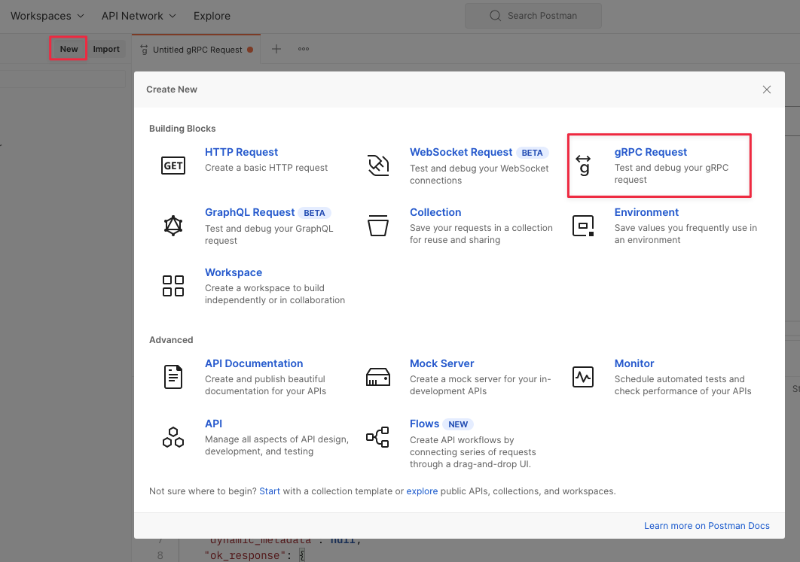
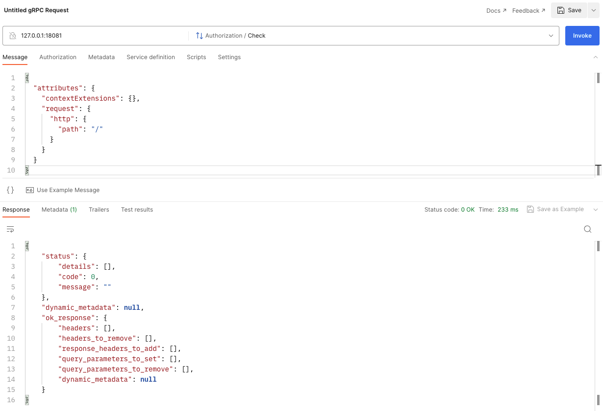
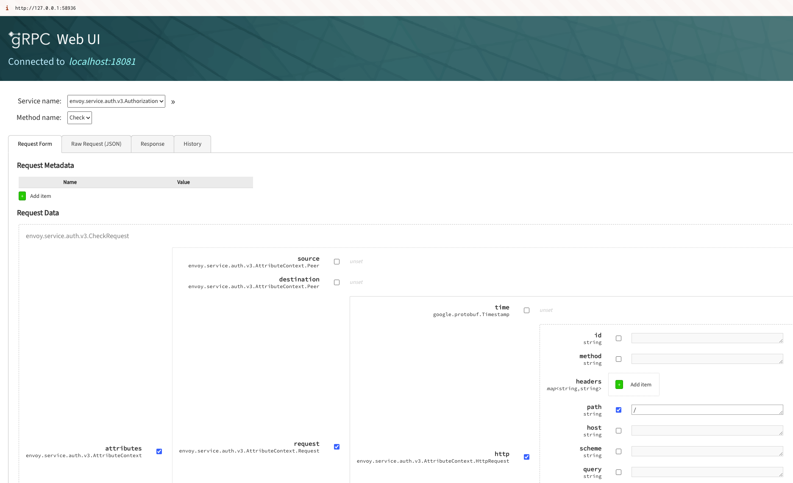

# envoy-auth-server-java

`envoy-auth-server-java` is a sample project that provides authentication capability plug-ins. You can freely use this project to quickly understand envoy auth capabilities, and freely build your security authentication services based on this.

## Introduction

`envoy-auth-server-java` is mainly divided into two submodules:

- [**(no need to modify)**] The `API` module is the definition of envoy's protobuf file.
- The `authz-grpc-server` module is the authentication logic processing address of the authentication server, and you can freely expand your authentication logic in this module.

In the sample project, we define the simplest authentication capability, you don't need to make any changes, just start the project:

```java
@GrpcService()
public class AuthzService extends AuthorizationGrpc. AuthorizationImplBase {
    @Override
    public void check(CheckRequest request, StreamObserver<CheckResponse> responseObserver) {
        CheckResponse checkResponse;
        if ("/".equals(request.getAttributes().getRequest().getHttp().getPath())){
            checkResponse = CheckResponse.newBuilder().setOkResponse(OkHttpResponse.getDefaultInstance()).setStatus(Status.newBuilder().setCode(Code.OK_VALUE)).build();
        } else {
            checkResponse = CheckResponse.newBuilder().setDeniedResponse(DeniedHttpResponse.newBuilder().setBody("No permission\n")).setStatus(Status.newBuilder().setCode(Code.PERMISSION_DENIED_VALUE).build()).build() ;
        }
        responseObserver.onNext(checkResponse);
        responseObserver.onCompleted();
    }
}
```

If the request path is the root directory ("/"), return a CheckResponse with OK status; otherwise, return a CheckResponse with PERMISSION_DENIED status, and set the response body (body) to "No permission\n".

## How to Develop

You can freely expand your authentication logic in the `authz-grpc-server` module. After you have completed the configuration of the authentication logic, you can build an image through `Dockerfile`, and then deploy it to your Kubernetes cluster.

### Build

In the sample project, we use Maven to build this project, you can complete the build with the command below, after the build is complete, you can find the built jar package in the `target` directory.

```shell
~ mvn clean package
```

### Example

Similarly, we have provided some deployment examples in the project, and we will continue to expand them in the future

- `envoy-auth-server.yaml` is a complete example that you can use directly to deploy your authentication service.
- `remote-jwks.yaml` is an example of using remote jwks, you can use this example to learn how to use remote jwks to complete authentication.

## How to Test

You can use this sample parameter to conduct tests. By modifying the Path parameter, you can see different results.

```json
{
  "attributes": {
    "contextExtensions": {},
    "request": {
      "http": {
        "path": "/"
      }
    }
  }
}
```

### Option 1. Postman

You can visit [Postman](https://web.postman.co/home) to test quickly without installing any software.




### Option 2. [grpcui](https://github.com/fullstorydev/grpcui)

> Install grpcui

You can visit the GitHub repository [grpcui](https://github.com/fullstorydev/grpcui) of this project to get the latest installation information.

> if use `grpcui` on Mac, you can use `brew` to install it.

```shell
#On Mac
brew install grpcui # https://formulae.brew.sh/formula/grpcui
```

> Run grpcui & Test

If your deployment is complete, you can start `grpcui` with the command below, and then use `grpcui` to test your authentication service.

```shell
 grpcui -plaintext localhost:18081
```


